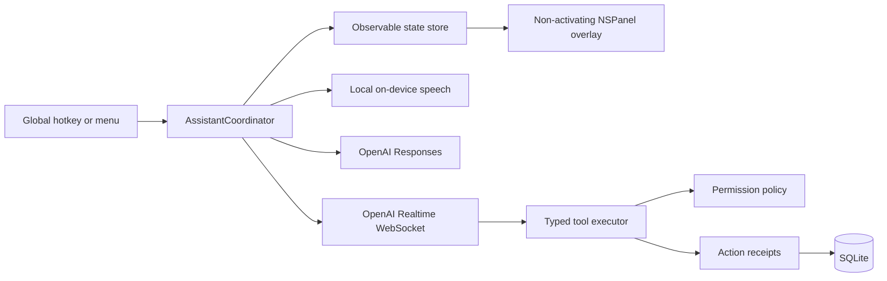
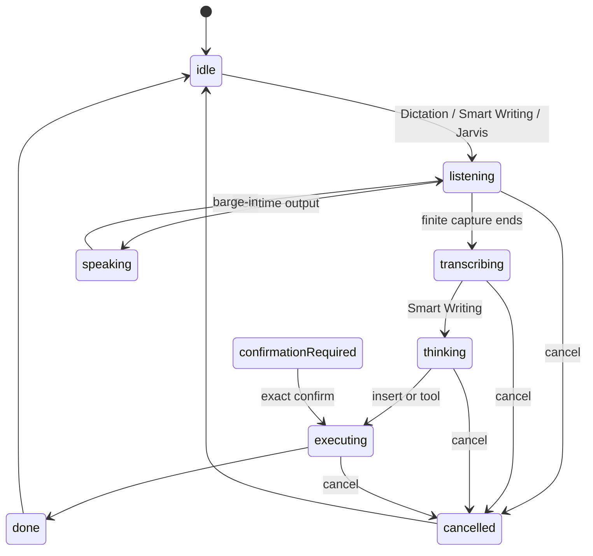
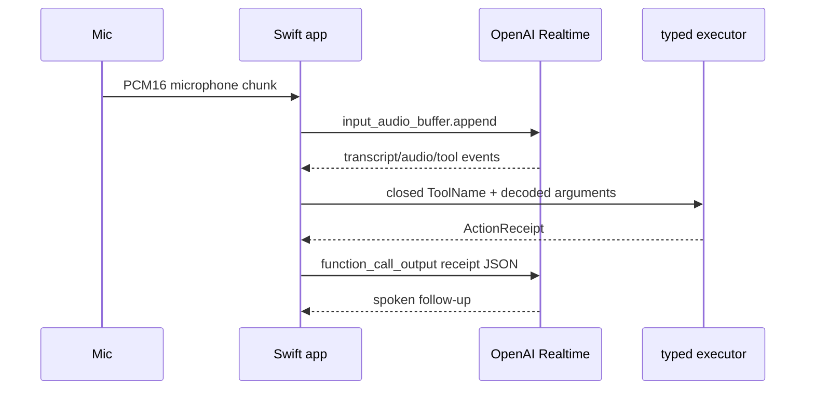

# Architecture

`keyboard.wtf` uses a Swift Package core and a small SwiftUI/AppKit app shell. Mutable feature state is owned by actors or injected objects; there is no service locator or global mutable app state.

## Mode flow

## Realtime and tools

The WebSocket client owns bounded, explicit receive/send work; the coordinator owns cancellation and never considers a model statement evidence of success. The Mac overlay receives published snapshots and is a non-key panel, so it does not steal the focused app.

## Persistence and cancellation

SQLite stores migrations, explicit personal memories, aliases, workflows, workflow runs, receipts, action/failure history, conversation summaries, and permission events. The current access layer writes memories/workflows/receipts and creates the remaining tables for forward migration. Sensitive values are rejected from automatic memory storage.

Cancellation rotates an operation identifier, stops AVAudioEngine and AVAudioPlayerNode, cancels local recognition tasks, sends Realtime cancellation/truncation, clears pending confirmation, and checks the operation identifier before a late transcription or Responses result can insert text.
